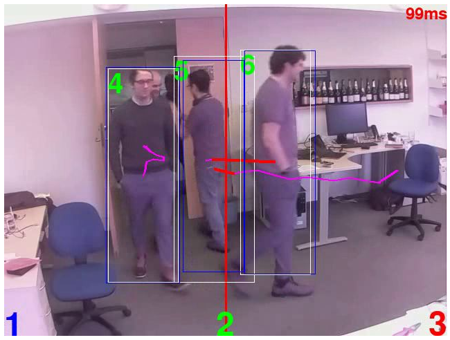

# DeepDish

Object recognition, tracking and counting (work-in-progress)



DeepDish is a CNN-based sensor designed to track and count people crossing a 'countline' assigned to the
camera field-of-view, using WiFi for real-time reporting to the Adaptive City platorm. The sensor uses a Raspberry
Pi and a Python framework with multiple alternative CNN models such that relative performance in terms of speed, 
accuracy and energy consumption can be assessed.

## Installation

Use of the Docker container is recommended for now.
```
make docker
./run.sh python3 deepdish.py <options>
```
## Overview

The Raspberry Pi and camera have been mounted into a custom housing as below:


The basic internal data pipeline is:


## YOLO model

Be sure to download the H5 file to the correct location.

- `wget -O detectors/yolo/yolo.h5 https://github.com/OlafenwaMoses/ImageAI/releases/download/1.0/yolo.h5`

## Simple examples

Use the SSD MobileNet backend with v1.
- `./run.sh python3 deepdish.py --model detectors/mobilenet/ssdmobilenetv1.tflite --labels detectors/mobilenet/labels.txt --encoder-model encoders/mars-64x32x3.pb --input input_file.mp4 --output output_file.mp4`

Use the Yolo backend.
- `./run.sh python3 deepdish.py --model detectors/yolo --labels detectors/yolo --encoder-model encoders/mars-64x32x3.pb --input input_file.mp4 --output output_file.mp4`

Use the EdgeTPU backend with one of the SSD MobileNet v2 models and track objects identified as cars, buses, trucks or bicycles:
- `./run.sh python3 deepdish.py --edgetpu --model=detectors/mobilenet/ssd_mobilenet_v2_coco_quant_postprocess_edgetpu.tflite --labels=detectors/mobilenet/labels.txt --encoder-model=encoders/mars-64x32x3.pb --wanted-labels car,bus,truck,bicycle`
